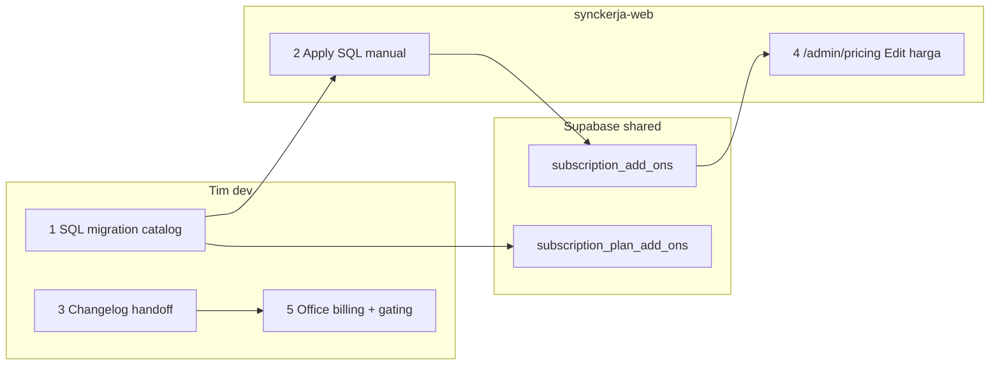

# Panduan: Menambahkan add-on di `/admin/pricing`

**Project:** synckerja-web (CMS admin) + synckerja Office (checkout & enforcement)  
**Terakhir diperbarui:** 2026-07-17

---

## Ringkasan

Halaman **`/admin/pricing` → tab Add-ons** bersifat **data-driven**: baris add-on muncul otomatis dari tabel `subscription_add_ons`. CMS hanya bisa **melihat** dan **mengedit harga/status** add-on yang sudah ada — **tidak ada** tombol "Tambah Add-on" di UI.

| Aksi | Di CMS? | Cara |
|------|---------|------|
| Lihat daftar add-on | Ya | Otomatis setelah baris ada di DB |
| Ubah harga default | Ya | Edit → sheet → Simpan (+ alasan audit) |
| Ikuti diskon plan / aktif-nonaktif | Ya | Toggle di sheet Edit |
| Override harga per plan | Ya | Tabel "Override per Plan" → Edit |
| Ubah `code`, `name`, `billing_unit` | Tidak | Hanya di seed SQL (migration) |
| **Buat add-on baru** | Tidak | Migration SQL (langkah di bawah) |

**RPC yang ada:** `admin_list_subscription_add_ons`, `admin_update_subscription_add_on`, `admin_update_plan_add_on_override` — **tidak ada** `admin_create_subscription_add_on`.

Komponen CMS:
- [`src/admin/components/AddOnsPricingTable.tsx`](../src/admin/components/AddOnsPricingTable.tsx)
- [`src/admin/components/EditAddOnPricingSheet.tsx`](../src/admin/components/EditAddOnPricingSheet.tsx)
- Migration RPC: [`supabase/migrations/20260709182100_admin_plan_pricing_rpc.sql`](../supabase/migrations/20260709182100_admin_plan_pricing_rpc.sql)

---

## Alur menambahkan add-on BARU



### Langkah 1 — Buat migration catalog (synckerja-web)

Buat file di `supabase/migrations/YYYYMMDDHHMMSS_nama_addon_catalog.sql`.

**Referensi:** [`20260717120000_lead_magnet_addon_catalog.sql`](../supabase/migrations/20260717120000_lead_magnet_addon_catalog.sql)

**Bagian A — baris catalog:**

```sql
INSERT INTO public.subscription_add_ons (
  code,
  name,
  description,
  billing_unit,
  default_unit_price_per_month,
  follows_plan_annual_discount,
  is_active
)
VALUES (
  'kode_addon',              -- unik, snake_case; dipakai di kode Office
  'Nama Tampilan',
  'Deskripsi singkat',
  'per_organization_month',  -- atau per_roster_staff_month (Omnichannel)
  99000,
  true,
  true
)
ON CONFLICT (code) DO NOTHING;
```

**Bagian B — junction ke plan HR eligible** (mirror Omnichannel / Lead Magnet):

```sql
INSERT INTO public.subscription_plan_add_ons (subscription_plan_id, add_on_id, display_order)
SELECT sp.id, sa.id, 10
FROM public.subscription_plans sp
CROSS JOIN public.subscription_add_ons sa
WHERE sa.code = 'kode_addon'
  AND sp.is_active = true
  AND sp.base_price_per_member > 0
  AND lower(trim(sp.name)) <> 'trial'
  AND lower(trim(sp.name)) NOT IN ('business', 'business plan')
  AND NOT (sp.name ~* '(^|[[:space:]])(starter|start[[:space:]]*up|startup)([[:space:]]|$)')
ON CONFLICT (subscription_plan_id, add_on_id) DO NOTHING;
```

### Langkah 2 — Apply SQL manual

Jalankan isi migration **sekali** di Supabase SQL Editor (DB shared). Jangan double-apply file yang sama.

### Langkah 3 — Changelog handoff

Tambah entry di bagian atas [`documents/synckerja-web`](./synckerja-web) (template: [`TEMPLATE-synckerja-web.md`](./TEMPLATE-synckerja-web.md)).

### Langkah 4 — Kelola harga di CMS

1. Buka `/admin/pricing` → tab **Add-ons**
2. Baris add-on baru muncul otomatis (refresh jika perlu)
3. Klik **Edit** → ubah harga default / diskon / status aktif → isi **alasan** (wajib, masuk audit log)
4. Untuk harga khusus per plan → section **Override per Plan** → **Edit**

### Langkah 5 — Office (wajib agar add-on bisa dibeli & dipakai)

CMS **hanya layer pricing**. Tanpa implementasi Office, add-on hanya tampil di catalog — tidak ada entitlement, Midtrans, atau gating fitur.

Contoh lengkap: **Lead Magnet** (`lead_magnet`):

| Layer | File / area Office |
|-------|-------------------|
| Entitlement DB | `20260717130000_lead_magnet_entitlement.sql` |
| Sales CMS toggle | `20260717140000_lead_magnet_sales_module_catalog.sql` + UI nested di CMS Organisasi |
| Checkout | `subscriptionUtils.ts`, `PlanCard`, Midtrans edge functions |
| Gating UI | `useLeadMagnetEntitlement`, `LeadMagnetContentGate` |
| Server | `lead-magnet-api`, `lead-magnet-runtime` |

Copy migration catalog ke `supabase/migrations/` repo Office agar history repo selaras.

---

## Pilih `billing_unit` saat seed

| `billing_unit` | Checkout Office | Contoh |
|----------------|-----------------|--------|
| `per_organization_month` | Toggle saja, qty = 1 (flat per org) | Lead Magnet |
| `per_roster_staff_month` | Toggle + slider seat (cap = member count) | Omnichannel |

---

## Add-on yang sudah ada (referensi)

| Code | Nama CMS | Billing unit | Default (saat seed) |
|------|----------|--------------|----------------------|
| `omnichannel_roster` | Omnichannel | `per_roster_staff_month` | Rp 125.000/seat (harga CMS bisa berbeda setelah edit) |
| `lead_magnet` | Lead Magnet | `per_organization_month` | Rp 99.000/org |

---

## Verifikasi setelah add-on baru

```sql
-- Catalog
SELECT code, name, default_unit_price_per_month, billing_unit, is_active
FROM subscription_add_ons
WHERE code = 'kode_addon';

-- Junction plan
SELECT sp.name, sa.code, pao.display_order, pao.unit_price_override_per_month
FROM subscription_plan_add_ons pao
JOIN subscription_plans sp ON sp.id = pao.subscription_plan_id
JOIN subscription_add_ons sa ON sa.id = pao.add_on_id
WHERE sa.code = 'kode_addon'
ORDER BY sp.name;
```

**CMS:** `/admin/pricing` → Add-ons → baris muncul; Edit harga → cek riwayat di sheet.

---

## FAQ

**Kenapa tidak ada tombol "Tambah Add-on"?**  
Add-on mengikat kontrak produk (`code`), billing unit, dan implementasi di Office. Seed via migration menjaga `code` konsisten antar repo dan menghindari typo dari UI.

**Bisakah ubah `code` setelah publish?**  
Tidak dari CMS. `code` dipakai di kode Office (konstanta, Midtrans, entitlement). Ubah `code` = migration + refactor Office.

**Harga di CMS langsung dipakai checkout?**  
Ya untuk harga default dan override per plan (`subscription_plan_add_ons.unit_price_override_per_month`). Office membaca dari DB saat checkout.

**Nonaktifkan add-on tanpa hapus baris?**  
Edit → matikan toggle **Add-on aktif** → `is_active = false`. Baris hilang dari checkout eligible (RLS `subscription_add_ons_select_active`).

---

## Grant Lead Magnet untuk tenant Sales (bukan mandiri)

Tenant **sales** (`subscription_self_service_enabled = false`) mendapat akses Lead Magnet lewat **toggle modul di CMS**, bukan checkout Midtrans.

### Langkah di CMS

1. Buka **Organisasi** → pilih tenant sales → **Edit**
2. Tab **Pengaturan** → section **Akses modul (upsell)**
3. Aktifkan **Digital Marketing** (prasyarat wajib)
4. Di bawah Digital Marketing, aktifkan sub-toggle **Lead Magnet** (nested, bukan baris modul sejajar)
5. Isi **Alasan perubahan modul** → **Simpan modul**

Lead Magnet tampil sebagai **sub-modul** di bawah Digital Marketing — sama seperti struktur menu di Office (`/digital-marketing/lead-magnet`).

### Catatan

| Tenant | Cara dapat Lead Magnet |
|--------|------------------------|
| **Sales** | CMS sub-toggle Lead Magnet (di bawah Digital Marketing) |
| **Mandiri** | Beli add-on di `/subscription/plans` (Midtrans) — **bukan** toggle di editor Plan |

Editor **Plan Mandiri** (`Create/Edit Plan` di `/admin/pricing`) **tidak** menampilkan Lead Magnet; add-on mandiri diatur lewat billing, bukan `subscription_plan_module_access`.

### SQL workaround (hanya jika CMS belum tersedia)

```sql
INSERT INTO organization_sales_module_access (organization_id, module_key, is_enabled)
VALUES ('<ORG_ID>', 'leadMagnet', true)
ON CONFLICT (organization_id, module_key) DO UPDATE SET is_enabled = true;
```

Pastikan `digitalMarketing` juga `is_enabled = true` untuk org yang sama.

